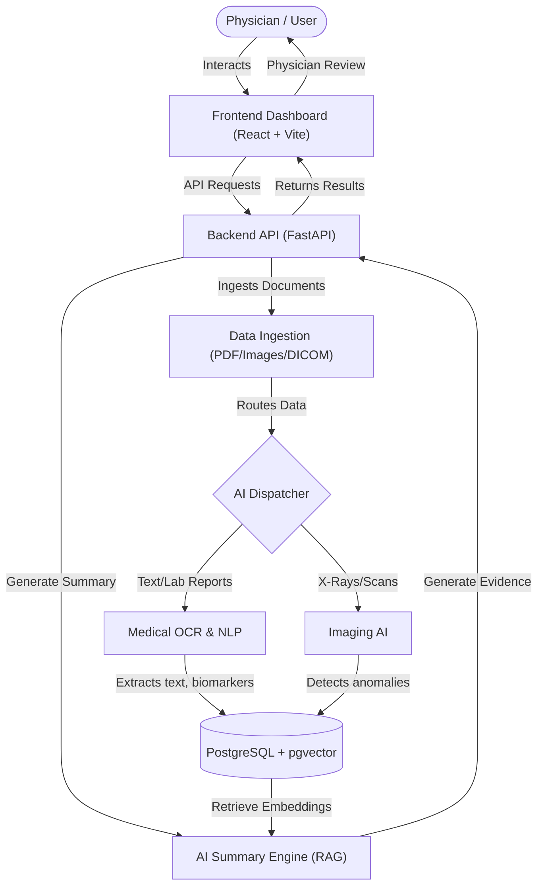

# MedVision Project Overview

## 1. How the Project Works

MedVision is an AI-powered multimodal Clinical Decision Support System (CDSS) that transforms fragmented healthcare data into structured, explainable, evidence-backed clinical intelligence. 

It aims to reduce physician cognitive overload by providing:
- **Multimodal healthcare data ingestion** (PDF, PNG, JPEG, DICOM, CSV, TXT)
- **Medical OCR and NLP** (extracting tables, parsing biomarkers, SNOMED mapping, ICD-10 normalization)
- **Imaging AI for radiology** (detecting opacity, pneumothorax, nodules, cardiomegaly)
- **AI-assisted clinical summaries** using RAG architectures

### Tech Stack
- **Backend**: FastAPI modular monolith following a layered architecture (`routes → controller → service → dao → db`).
- **Frontend**: React + Vite enterprise dashboard.
- **Data Layer**: PostgreSQL (with **pgvector** for RAG embeddings and similarity search), Redis for caching and future job queues.
- **AI**: Isolated service layer with a singleton model loader.

### System Flow


## 2. Current Codebase Directory Structure

```text
MedVision/
├── backend/                # FastAPI Application
│   ├── api/                # API definitions
│   ├── auth/               # Authentication logic
│   ├── client/             # External service clients
│   ├── config/             # Configuration & environment variables
│   ├── controller/         # Request handling and routing logic
│   ├── core/               # Core application setup
│   ├── dao/                # Data Access Objects (DB queries)
│   ├── db/                 # Database connection & setup
│   ├── decorators/         # Custom Python decorators
│   ├── dto/                # Data Transfer Objects (Pydantic schemas)
│   ├── enums/              # Enumerations
│   ├── logger/             # Logging configuration
│   ├── middleware/         # FastAPI middlewares
│   ├── migrations/         # Alembic database migrations
│   ├── model/              # SQLAlchemy database models
│   ├── routes/             # API route registration
│   ├── service/            # Business logic layer
│   ├── tests/              # Pytest test suite
│   └── utils/              # Utility functions and helpers
├── frontend/               # React + Vite Dashboard
│   ├── src/                # UI source code
│   ├── nginx.conf          # NGINX configuration for prod builds
│   └── vite.config.js      # Vite build configuration
├── data/                   # Seed data or local data storage
├── docs/                   # Documentation (Agile sprint playbook, etc.)
├── infra/                  # Infrastructure and deployment manifests
├── scripts/                # Utility scripts (seed_database.py, quality_gate.ps1)
├── .github/                # GitHub Actions CI/CD workflows
├── docker-compose.yml      # Local multi-container Docker setup
└── pyproject.toml          # Python project configuration (Ruff, Black)
```

## 3. Project Workflow

### Development
The project follows strict engineering standards:
- **Agile Methodology**: Driven by a sprint playbook, backlog, and Definition of Done (DoD) tracked in `docs/agile/`.
- **Code Quality**: Enforced by PEP8 (88-char lines) using `ruff` and `black`. All PRs must pass the quality gate script (`.\scripts\quality_gate.ps1`) before merging.
- **Continuous Integration**: CI runs on every Pull Request via GitHub Actions.

### Running the App
Developers can spin up the application via Docker or locally:
- **Docker**: `docker compose up --build` runs the entire stack (API on port 5000, UI on 8080, along with Postgres and Redis).
- **Local Native**: Uses a Python virtual environment for the backend (`uvicorn backend.app:create_app --factory --reload --port 5000`) and `npm run dev` for the frontend.

## 4. Path to Production-Ready

While MedVision provides a solid production structure, operational hardening is required before any hospital or enterprise deployment.

### Security & Compliance (Critical)
- **Secret Management**: Integrate HashiCorp Vault or AWS Secrets Manager for managing credentials, keys, and DB passwords.
- **Data Encryption**: Enforce TLS 1.3 for all in-transit data and implement AES-256 PHI (Protected Health Information) encryption at rest.
- **Authentication Hardening**: Enforce Multi-Factor Authentication (MFA) and strict Role-Based Access Control (RBAC).

### Scalability & Infrastructure
- **Async Job Queue**: Fully implement Redis (e.g., using Celery or RQ) for heavy AI inference tasks (Imaging, OCR) to prevent blocking the FastAPI event loop.
- **Container Orchestration**: Migrate from `docker-compose` to Kubernetes (Helm charts) for high availability, auto-scaling, and self-healing.
- **Database Scalability**: Utilize a managed PostgreSQL instance (like AWS RDS or GCP Cloud SQL) configured with `pgvector` for high availability and automated backups.

### Observability & Reliability
- **Monitoring & Alerting**: Integrate Prometheus and Grafana or Datadog for system metrics (CPU, RAM, API latency).
- **Centralized Logging**: Stream logs to ELK (Elasticsearch, Logstash, Kibana) or Datadog for distributed tracing.
- **Rate Limiting & WAF**: Implement a Web Application Firewall (WAF) and API rate limiting to protect against DDoS and abuse.

### Feature Roadmap (Future Phases)
- **Integration**: PACS integration and complete HL7 FHIR compliance for interoperability with hospital EMR systems.
- **Explainability Validation**: Ensure all AI summary generations enforce mandatory physician review before writing back to patient records.
